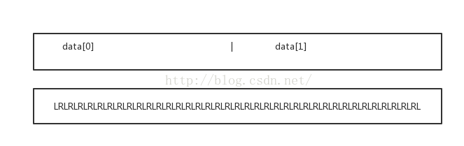
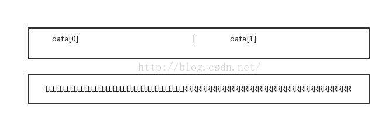
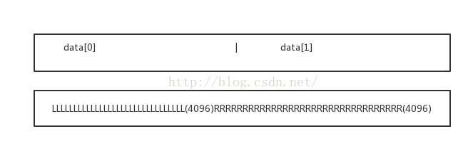

# 学习性代码 偏重文档性质
## 环境说明：
+ Mac OS 10.8
+ FFmpeg 4+
+ SDL2 
+ c/c++ 代码都有

## XOS编译要点
* makefile + vscode 开发测试
* 配置文件保留在`.vscode`文件中
* makefile需要手动调整引用路径
* XOS上貌似sdl不能良好显示图像，需要x11
* 修改后可运行代码都使用SDL2

# 速成文档
## 对象/结构体
```text
AVCodecContext
AVCodec
AVCodecID
AVFrame
AVPacket

AVCodec是一个编码器，可以单纯的理解为一个编解码算法的结构。

AVCodecContext是AVCodec的一个上下文，
打个比如，在视频编码h264时，有i p b三种帧，
如果有一个视频流是 I B B P这种顺序到达，由于B帧需要依靠前后的帧来计算出本帧现实的内容，
需要一些buffer保存一些，以根据这些来计算出B帧的内容，

AVCodecID是编码器的ID，如编码AAC是，就使用AV_CODEC_ID_AAC。

AVFrame 是编码前、解码后保存的数据。
AVPacket是编码后、解码前保存的数据。
```
## 声音概念
Planar类型：平面

后面有P的就代表是平面类型，所谓平面，即是音频数据不再是如此存储：

L（一个采样点）R（一个采样点）LRLRLRLR...............

对AVFrame而言，应该是data[0],data[1]分别指向左右声道数据，这就是平面的概念。（可以类比视频解码时的YUV存储方式）

L(一帧)R（一帧）LRLRLR............................


### AAC


AVFrame->nb_samples 默认是1024，所以每一帧一个声道读取的数据为：

`int length = AVFrame->nb_samples * av_get_byte_per_sample((AVSampleFormat)AVFrame->format);`

这里也就是4096字节。

# 4.0+ 废弃方法
```c++
// avcodec_decode_audio4：被声明为已否决：
// 4.0+
int ret = avcodec_send_packet(aCodecCtx, &pkt);
if (ret != 0){prinitf("%s/n","error");}
while( avcodec_receive_frame(aCodecCtx, &frame) == 0){
	//读取到一帧音频或者视频
	//处理解码后音视频 frame
}
```
# avcodec_send_packet & avcodec_receive_frame
## 空间申请和释放问题
解码后图像空间由函数内部申请，你所做的只需要分配 AVFrame 对象空间，

如果你每次调用avcodec_receive_frame传递同一个对象，接口内部会判断空间是否已经分配，如果没有分配会在函数内部分配。
## avcodec_send_packet和avcodec_receive_frame调用关系并不一定是一对一的，
比如一些音频数据一个AVPacket中包含了1秒钟的音频，调用一次avcodec_send_packet之后，

可能需要调用25次 avcodec_receive_frame才能获取全部的解码音频数据，

所以要做如下处理：
```c++
int re = avcodec_send_packet(codec, pkt);
if (re != 0)
{
    return;
}
while(avcodec_receive_frame(codec, frame) == 0)
{

    //读取到一帧音频或者视频
    //处理解码后音视频 frame

}
```

===================================
ffmpeg-tutorial
===============

* * *
教程实验代码来自[mpenkov/ffmpeg-tutorial](https://github.com/mpenkov/ffmpeg-tutorial)，作者已经停止维护，我在他的基础上，修改了代码学习FFmpeg。

作者的声明如下：

The [original tutorials](http://dranger.com/ffmpeg/) have now been [updated](https://ffmpeg.org/pipermail/libav-user/2015-February/007896.html).
I won't be maintaining this project anymore, and am keeping it here for historical reasons.
* * *

#### 环境说明：
+ Ubuntu 16.04.1 LTS
+ FFmpeg 2.8.7
+ SDL 1.2 

#### 编译运行

+ 首先通过源代码安装[FFmpeg 2.8.7](https://ffmpeg.org/download.html#releases)，然后编译本教程代码，通过如下命令：

	    git clone https://github.com/feixiao/ffmpeg-tutorial.git
    	cd ffmpeg-tutorial
    	make
  
+ 通过如下命令运行程序：
 	
 	 bin/tutorial01.out

#### 实验例子：
+ tutorial01
	+ 将前面的５帧图像分别保存到文件。
+ tutorial02
	+ 使用SDL播放视频帧数据。
+ tutorial03
	+ 播放音视频数据。
+ tutorial04
	+ 增加独立线程处理视频数据。
+ tutorial05
	+ 在tutorial04的基础上面增加pts进行同步。
+ tutorial06
	+ 在tutorial05的基础上面选择不同的音视频同步策略。
+ tutorial07
	+ 在tutorial06的基础上面增加seek处理。
+ tutorial08
	+ 使用rtp打包aac和h264文件。

#### 参考资料
+ [FFMPEG完美入门资料](http://download.csdn.net/download/leeking1989/7111345)
+ [一个广院工科生的视音频技术笔记](http://blog.csdn.net/leixiaohua1020)
